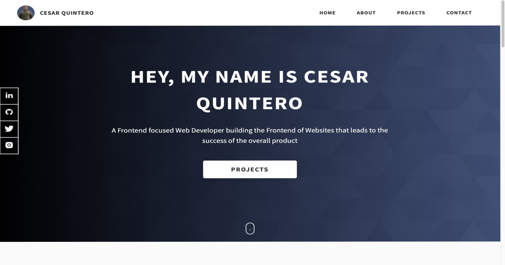

  
  
  
  
  

Full-Stack Software Engineer, I am motivated by the power of technology as a tool to help people do amazing thing and create positive change in the world.

See [my website](https://realcesarquintero.com/) for more information!

<h1 align="center">Projects</h1>
<table bordercolor="#66b2b2">
  
  <tr>
    <td width="50%" valign="top">
      <h3 align="center">Coiffeur</h3>
         
        
         
        

          
    
  
      

        
A fully responsive, beautiful, and modern website for an on-trend full-service salon.

    </td>
    <td width="50%" valign="top">
      <h3 align="center">Donut King</h3>
         
      
         
        

          
  
  gt
  
      

        
Another fully responsive website for an online niche donut shop delivering hand-made donuts to donut enthusiasts.

    </td>
  </tr>
  
  <tr>
    <td width="50%" valign="top">
      <h3 align="center">RealCesarQuintero.com</h3>
       
        
       
        

  
  
      

        
<strong>Portfolio Site including links to my projects and ways to get in contact with me.

    </td>
    <td width="50%" valign="top">
      <h3 align="center">Jeffry Oneil Photography</h3>
         
        
         
        

          
  
  
      

        
An online showcase of a collection of photographs by photographer Jeffry Oneill.

    </td>
  </tr>
</table>

<h1 align="center">Technologies</h1>

    
    
    <!--  -->
    
    
    
    
    
    
    
    <!--  -->
    <!--  -->
    <!--  -->
    <!--  -->
    <!--  -->
    <!--  -->
    <!--  -->
    
    
    
    <!--  -->
    
    <!--  -->

---

<h1 align="center">Connect</h1>

  
  
  
  
  

